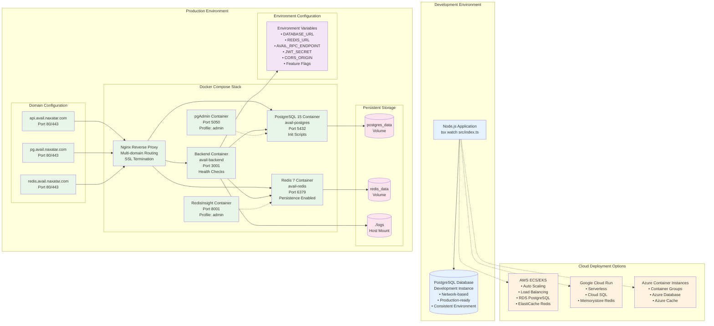
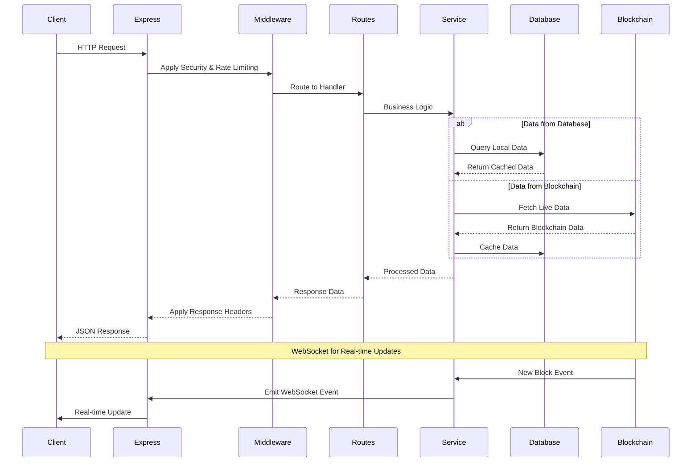
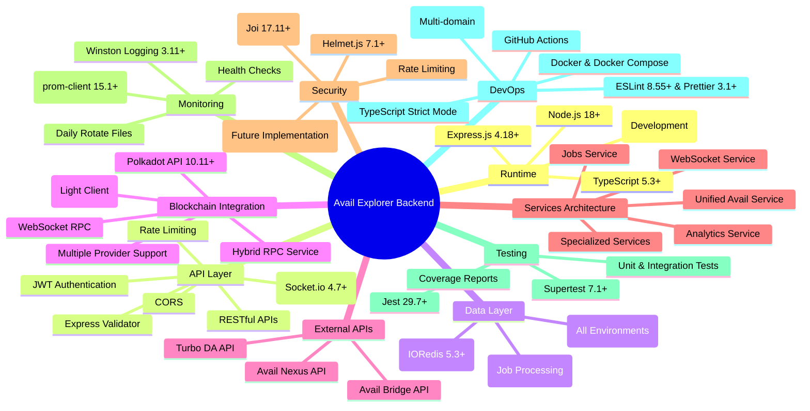
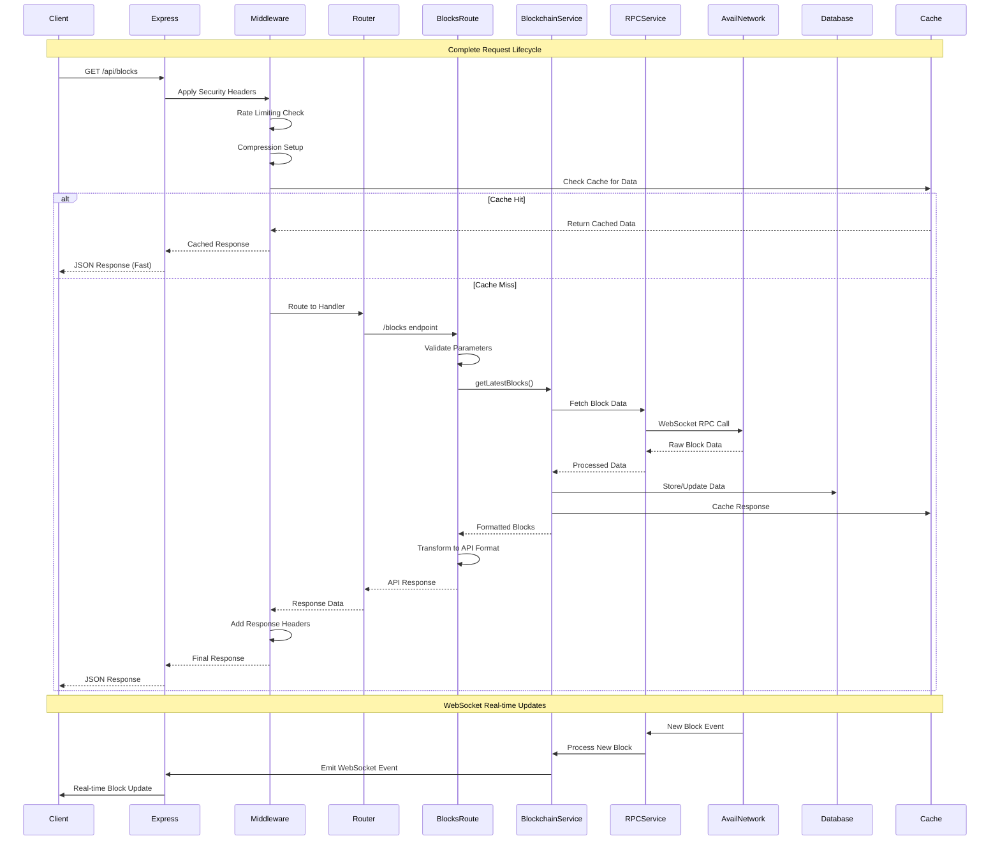
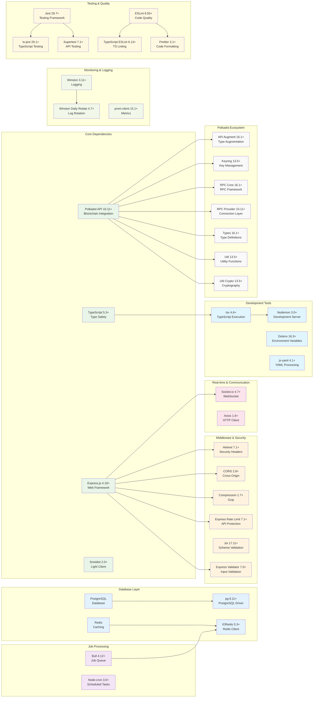

# Avail Explorer Backend - Project Architecture

## Overview
This document contains mermaid diagrams explaining the architecture of the Avail Explorer Backend project.

## Main Architecture Diagram

```mermaid
graph TB
    %% External Services
    subgraph "External Services"
        AVAIL[Avail Blockchain Network<br/>WebSocket RPC]
        TURBO_DA[Turbo DA API<br/>Data Availability]
        NEXUS[Avail Nexus API<br/>Rollup Data]
        BRIDGE[Avail Bridge API<br/>Cross-chain Data]
    end

    %% Client Layer
    subgraph "Client Layer"
        WEB[Web Frontend<br/>React/Next.js]
        MOBILE[Mobile Apps]
        API_CLIENTS[API Clients]
    end

    %% Load Balancer / Reverse Proxy
    subgraph "Load Balancer / Reverse Proxy"
        NGINX[Nginx<br/>Domain Routing<br/>• api.avail.naxatar.com<br/>• pg.avail.naxatar.com<br/>• redis.avail.naxatar.com]
    end

    %% Main Application
    subgraph "Avail Explorer Backend"
        subgraph "API Layer"
            EXPRESS[Express.js Server<br/>Port 3001]
            WEBSOCKET_SERVER[WebSocket Server<br/>Socket.io]
            MIDDLEWARE[Middleware Layer<br/>• CORS<br/>• Rate Limiting<br/>• Security Headers<br/>• Compression<br/>• JWT Auth]
        end

        subgraph "Route Handlers"
            BLOCKS_ROUTE[Blocks Routes<br/>/api/blocks]
            CHAIN_ROUTE[Chain Routes<br/>/api/chain]
            EXTRINSICS_ROUTE[Extrinsics Routes<br/>/api/extrinsics]
            SEARCH_ROUTE[Search Routes<br/>/api/search]
            ACCOUNTS_ROUTE[Accounts Routes<br/>/api/accounts]
            VALIDATORS_ROUTE[Validators Routes<br/>/api/validators]
            ANALYTICS_ROUTE[Analytics Routes<br/>/api/analytics]
            ROLLUPS_ROUTE[Rollups Routes<br/>/api/rollups]
            DATA_SUB_ROUTE[Data Submissions Routes<br/>/api/data-submissions]
        end

        subgraph "Service Layer"
            UNIFIED_AVAIL[Unified Avail Service<br/>• Multi-source Integration<br/>• Unified Data API<br/>• Service Orchestration]
            BLOCKCHAIN_SERVICE[Blockchain Service<br/>• Polkadot API Integration<br/>• Real-time Data Fetching<br/>• Block Processing]
            HYBRID_RPC[Hybrid RPC Service<br/>• Multi-provider Support<br/>• Failover Logic<br/>• Load Balancing]
            ANALYTICS_SERVICE[Analytics Service<br/>• Performance Metrics<br/>• Usage Statistics<br/>• Historical Data]
            WEBSOCKET_SERVICE[WebSocket Service<br/>• Real-time Events<br/>• Client Management<br/>• Event Broadcasting]
            JOBS_SERVICE[Jobs Service<br/>• Background Processing<br/>• Scheduled Tasks<br/>• Queue Management]
            
            subgraph "Specialized Services"
                TURBO_DA_SERVICE[Turbo DA Service<br/>• DA Layer Integration<br/>• Data Retrieval]
                NEXUS_SERVICE[Avail Nexus Service<br/>• Rollup Management<br/>• Cross-rollup Data]
                LIGHT_CLIENT[Avail Light Client<br/>• Light Node Integration<br/>• Minimal Sync]
                BRIDGE_SERVICE[Avail Bridge Service<br/>• Cross-chain Bridge<br/>• Transfer Tracking]
            end

            DATA_SERVICE[Data Service<br/>• Database Operations<br/>• Caching Logic<br/>• Data Validation]
        end

        subgraph "Data Layer"
            DATA_DIR[data/]
            POSTGRES_STORE[postgres-store.ts<br/>Database Operations]
        end
    end

    %% Infrastructure Services
    subgraph "Infrastructure"
        subgraph "All Environments"
            POSTGRES[(PostgreSQL 15<br/>Database<br/>• High Performance<br/>• Concurrent Access<br/>• ACID Compliance)]
            REDIS_CACHE[(Redis 7<br/>Cache & Sessions<br/>• IORedis Client<br/>• Session Storage<br/>• API Caching<br/>• Real-time Data)]
            BULL_QUEUE[Bull Queue<br/>• Job Processing<br/>• Background Tasks<br/>• Redis-backed]
        end
    end

    %% Monitoring & Logging
    subgraph "Observability"
        LOGS[Winston Logger<br/>• Daily Rotate Files<br/>• Multiple Log Levels<br/>• Structured Logging]
        METRICS[Prometheus Metrics<br/>• prom-client<br/>• Performance Monitoring<br/>• Health Checks]
        HEALTH[Health Endpoints<br/>/health<br/>/metrics]
    end

    %% Data Flow Connections
    WEB --> NGINX
    MOBILE --> NGINX
    API_CLIENTS --> NGINX
    NGINX --> EXPRESS

    EXPRESS --> MIDDLEWARE
    MIDDLEWARE --> BLOCKS_ROUTE
    MIDDLEWARE --> CHAIN_ROUTE
    MIDDLEWARE --> EXTRINSICS_ROUTE
    MIDDLEWARE --> SEARCH_ROUTE
    MIDDLEWARE --> ACCOUNTS_ROUTE
    MIDDLEWARE --> VALIDATORS_ROUTE
    MIDDLEWARE --> ANALYTICS_ROUTE
    MIDDLEWARE --> ROLLUPS_ROUTE
    MIDDLEWARE --> DATA_SUB_ROUTE

    BLOCKS_ROUTE --> UNIFIED_AVAIL
    CHAIN_ROUTE --> BLOCKCHAIN_SERVICE
    EXTRINSICS_ROUTE --> HYBRID_RPC
    SEARCH_ROUTE --> DATA_SERVICE
    ACCOUNTS_ROUTE --> DATA_SERVICE
    VALIDATORS_ROUTE --> BLOCKCHAIN_SERVICE
    ANALYTICS_ROUTE --> ANALYTICS_SERVICE
    ROLLUPS_ROUTE --> NEXUS_SERVICE
    DATA_SUB_ROUTE --> TURBO_DA_SERVICE

    UNIFIED_AVAIL --> BLOCKCHAIN_SERVICE
    UNIFIED_AVAIL --> HYBRID_RPC
    UNIFIED_AVAIL --> TURBO_DA_SERVICE
    UNIFIED_AVAIL --> NEXUS_SERVICE
    UNIFIED_AVAIL --> LIGHT_CLIENT
    UNIFIED_AVAIL --> BRIDGE_SERVICE

    BLOCKCHAIN_SERVICE --> AVAIL
    HYBRID_RPC --> AVAIL
    HYBRID_RPC --> TURBO_DA
    TURBO_DA_SERVICE --> TURBO_DA
    NEXUS_SERVICE --> NEXUS
    BRIDGE_SERVICE --> BRIDGE

    WEBSOCKET_SERVICE --> WEBSOCKET_SERVER
    JOBS_SERVICE --> BULL_QUEUE

    BLOCKCHAIN_SERVICE --> DATA_SERVICE
    ANALYTICS_SERVICE --> DATA_SERVICE
    DATA_SERVICE --> POSTGRES_STORE

    %% Production connections
    DATA_SERVICE -.-> POSTGRES
    DATA_SERVICE -.-> REDIS_CACHE
    JOBS_SERVICE -.-> BULL_QUEUE

    %% WebSocket connections
    EXPRESS --> WEBSOCKET_SERVER
    WEBSOCKET_SERVER -.-> WEB
    WEBSOCKET_SERVER -.-> MOBILE
    WEBSOCKET_SERVICE --> WEBSOCKET_SERVER

    %% Monitoring connections
    EXPRESS --> LOGS
    EXPRESS --> METRICS
    EXPRESS --> HEALTH

    %% Styling
    classDef external fill:#e1f5fe
    classDef client fill:#f3e5f5
    classDef proxy fill:#e8f5e8
    classDef api fill:#e8f5e8
    classDef service fill:#fff3e0
    classDef specialized fill:#f3e5f5
    classDef data fill:#fce4ec
    classDef infra fill:#f1f8e9
    classDef monitoring fill:#fff8e1

    class AVAIL,TURBO_DA,NEXUS,BRIDGE external
    class WEB,MOBILE,API_CLIENTS client
    class NGINX proxy
    class EXPRESS,WEBSOCKET_SERVER,MIDDLEWARE,BLOCKS_ROUTE,CHAIN_ROUTE,EXTRINSICS_ROUTE,SEARCH_ROUTE,ACCOUNTS_ROUTE,VALIDATORS_ROUTE,ANALYTICS_ROUTE,ROLLUPS_ROUTE,DATA_SUB_ROUTE api
    class UNIFIED_AVAIL,BLOCKCHAIN_SERVICE,HYBRID_RPC,ANALYTICS_SERVICE,WEBSOCKET_SERVICE,JOBS_SERVICE,DATA_SERVICE service
    class TURBO_DA_SERVICE,NEXUS_SERVICE,LIGHT_CLIENT,BRIDGE_SERVICE specialized
    class POSTGRES_STORE data
    class POSTGRES,REDIS_CACHE,BULL_QUEUE infra
    class LOGS,METRICS,HEALTH monitoring
```

## Deployment Architecture

## API Flow Diagram

## Technology Stack

## Key Features

1. **Unified Service Architecture**: Centralized service orchestration through unified-avail.ts for seamless multi-source integration
2. **Hybrid RPC Support**: Multi-provider RPC service with automatic failover and load balancing capabilities
3. **Specialized Data Sources**: Integration with Turbo DA, Avail Nexus, Avail Bridge, and Light Client services
4. **PostgreSQL Database**: PostgreSQL 15 for all environments with consistent schema and performance
5. **Advanced Caching**: Redis 7 with IORedis client for high-performance caching and session management
6. **Real-time Updates**: WebSocket integration with Socket.io for live blockchain data and analytics
7. **Background Job Processing**: Bull queue system for asynchronous task processing and scheduled operations
8. **Comprehensive API Coverage**: Full REST API with blocks, chain, extrinsics, validators, rollups, analytics, and search endpoints
9. **Production-Ready Infrastructure**: Docker containerization with multi-domain nginx configuration
10. **Advanced Monitoring**: Prometheus metrics, Winston logging with daily rotation, and health endpoints
11. **Analytics & Performance Tracking**: Dedicated analytics service for usage statistics and performance metrics
12. **Multi-Environment Support**: Development-friendly setup with production-grade deployment options
13. **Type-Safe Development**: Full TypeScript implementation with strict type checking
14. **Comprehensive Testing**: Jest-based testing with unit, integration, and E2E test coverage
15. **Domain-Based Deployment**: Multi-domain nginx setup with api.avail.naxatar.com routing

## File Structure Diagram

```mermaid
graph TD
    subgraph "Project Root"
        ROOT["/"]
        PACKAGE[package.json]
        DOCKER[docker-compose.yml]
        DOCKERFILE[Dockerfile]
        TSCONFIG[tsconfig.json]
        ESLINT[.eslintrc.js]
        JEST[jest.config.js]
        ENV[env.example]
        README[README.md]
        DEPLOYMENT[DEPLOYMENT.md]
        INSTALL[install.sh]
        SETUP_DEV[setup-dev.js]
        NGINX_CONF[nginx.conf]
        AVAIL_NGINX[avail-nginx.conf]
        API_CONF[api-avail.conf]
        PG_CONF[pg-avail.conf]
        REDIS_CONF[redis-avail.conf]
        INIT_SQL[init.sql]
        SCHEMA_V2[database-schema-v2.sql]
        GITIGNORE[.gitignore]
        DOCKERIGNORE[.dockerignore]
    end

    subgraph "Source Code (/src)"
        SRC[src/]
        INDEX[index.ts<br/>Main Entry Point]
        TEST_RUNNER[test-runner.ts<br/>Test Utilities]
        TEST_AVAIL[test-avail-apis.ts<br/>API Testing]
        
        subgraph "Configuration"
            CONFIG_DIR[config/]
            CONFIG_INDEX[index.ts<br/>App Configuration]
        end
        
        subgraph "API Routes"
            ROUTES_DIR[routes/]
            BLOCKS_ROUTE[blocks.ts<br/>Block Endpoints]
            CHAIN_ROUTE[chain.ts<br/>Chain Stats]
            EXTRINSICS_ROUTE[extrinsics.ts<br/>Transaction Data]
            SEARCH_ROUTE[search.ts<br/>Search Functionality]
            ACCOUNTS_ROUTE[accounts.ts<br/>Account Data]
            VALIDATORS_ROUTE[validators.ts<br/>Validator Information]
            ANALYTICS_ROUTE[analytics.ts<br/>Analytics Endpoints]
            ROLLUPS_ROUTE[rollups.ts<br/>Rollup Data]
            DATA_SUB_ROUTE[data-submissions.ts<br/>Data Submission Tracking]
        end
        
        subgraph "Business Logic"
            SERVICES_DIR[services/]
            BLOCKCHAIN_SERVICE[blockchain.ts<br/>Main Blockchain Service]
            UNIFIED_AVAIL[unified-avail.ts<br/>Unified Service Layer]
            HYBRID_RPC[hybrid-rpc.ts<br/>Multi-provider RPC]
            HYBRID_RPC_TEST[hybrid-rpc-test.ts<br/>RPC Testing]
            ANALYTICS_SERVICE[analytics.ts<br/>Analytics Service]
            WEBSOCKET_SERVICE[websocket.ts<br/>WebSocket Management]
            JOBS_SERVICE[jobs.ts<br/>Background Jobs]
            
            subgraph "Specialized Services"
                TURBO_DA[turbo-da.ts<br/>Turbo DA Integration]
                AVAIL_NEXUS[avail-nexus.ts<br/>Nexus API Service]
                LIGHT_CLIENT[avail-light-client.ts<br/>Light Client Service]
                BRIDGE_SERVICE[avail-bridge.ts<br/>Bridge Service]
            end
            
            subgraph "RPC Layer"
                RPC_DIR[rpc/]
                RPC_INDEX[index.ts<br/>RPC Service]
                RPC_CONNECTION[connection.ts<br/>WebSocket Management]
                RPC_METHODS[methods.ts<br/>API Methods]
                RPC_SUBSCRIPTIONS[subscriptions.ts<br/>Real-time Events]
            end
            
            subgraph "Data Layer"
                DATA_DIR[data/]
                POSTGRES_STORE[postgres-store.ts<br/>Database Operations]
            end
        end
        
        subgraph "Middleware"
            MIDDLEWARE_DIR[middleware/]
            MIDDLEWARE_INDEX[index.ts<br/>All Middleware]
        end
        
        subgraph "Utilities"
            UTILS_DIR[utils/]
            LOGGER[logger.ts<br/>Winston Logging]
            DATABASE[database.ts<br/>DB Connection]
            CACHE[cache.ts<br/>Redis Cache]
        end
        
        subgraph "Type Definitions"
            TYPES_DIR[types/]
            TYPES_INDEX[index.ts<br/>Core Types]
            RPC_TYPES[rpc.ts<br/>RPC Types]
        end
    end

    subgraph "Tests (/tests)"
        TESTS[tests/]
        TEST_SETUP[setup.ts]
        GLOBAL_SETUP[globalSetup.ts]
        GLOBAL_TEARDOWN[globalTeardown.ts]
        
        subgraph "Test Organization"
            SRC_TESTS[src/__tests__/<br/>Source Tests]
            UNIT_TESTS[unit/<br/>Unit Tests]
            INTEGRATION_TESTS[integration/<br/>Integration Tests]
            E2E_TESTS[e2e/<br/>End-to-End Tests]
            FIXTURES[fixtures/<br/>Test Data]
            HELPERS[helpers/<br/>Test Utilities]
        end
    end

    subgraph "Data & Logs"
        LOGS_FOLDER[logs/<br/>Application Logs]
        DIST_FOLDER[dist/<br/>Compiled JavaScript]
        NODE_MODULES[node_modules/<br/>Dependencies]
        DUMP_RDB[dump.rdb<br/>Redis Dump]
    end

    subgraph "CI/CD"
        GITHUB_DIR[.github/]
        WORKFLOWS[workflows/<br/>GitHub Actions]
    end

    subgraph "Documentation"
        AI_DOCS[AI Documentation/<br/>Project Notes & Architecture]
        SCOPE_DOC[Avail DA Explorer Scope.md]
        DEPLOYMENT_STATUS[deployment-status.md]
    end

    %% Connections
    ROOT --> SRC
    ROOT --> TESTS
    ROOT --> DATA_FOLDER
    ROOT --> LOGS_FOLDER
    ROOT --> DIST_FOLDER
    ROOT --> GITHUB_DIR
    ROOT --> AI_DOCS
    
    SRC --> INDEX
    SRC --> TEST_RUNNER
    SRC --> TEST_AVAIL
    SRC --> CONFIG_DIR
    SRC --> ROUTES_DIR
    SRC --> SERVICES_DIR
    SRC --> MIDDLEWARE_DIR
    SRC --> UTILS_DIR
    SRC --> TYPES_DIR
    
    CONFIG_DIR --> CONFIG_INDEX
    ROUTES_DIR --> BLOCKS_ROUTE
    ROUTES_DIR --> CHAIN_ROUTE
    ROUTES_DIR --> EXTRINSICS_ROUTE
    ROUTES_DIR --> SEARCH_ROUTE
    ROUTES_DIR --> ACCOUNTS_ROUTE
    ROUTES_DIR --> VALIDATORS_ROUTE
    ROUTES_DIR --> ANALYTICS_ROUTE
    ROUTES_DIR --> ROLLUPS_ROUTE
    ROUTES_DIR --> DATA_SUB_ROUTE
    
    SERVICES_DIR --> BLOCKCHAIN_SERVICE
    SERVICES_DIR --> UNIFIED_AVAIL
    SERVICES_DIR --> HYBRID_RPC
    SERVICES_DIR --> HYBRID_RPC_TEST
    SERVICES_DIR --> ANALYTICS_SERVICE
    SERVICES_DIR --> WEBSOCKET_SERVICE
    SERVICES_DIR --> JOBS_SERVICE
    SERVICES_DIR --> TURBO_DA
    SERVICES_DIR --> AVAIL_NEXUS
    SERVICES_DIR --> LIGHT_CLIENT
    SERVICES_DIR --> BRIDGE_SERVICE
    SERVICES_DIR --> RPC_DIR
    SERVICES_DIR --> DATA_DIR
    
    RPC_DIR --> RPC_INDEX
    RPC_DIR --> RPC_CONNECTION
    RPC_DIR --> RPC_METHODS
    RPC_DIR --> RPC_SUBSCRIPTIONS
    
    DATA_DIR --> POSTGRES_STORE
    
    MIDDLEWARE_DIR --> MIDDLEWARE_INDEX
    UTILS_DIR --> LOGGER
    UTILS_DIR --> DATABASE
    UTILS_DIR --> CACHE
    
    TYPES_DIR --> TYPES_INDEX
    TYPES_DIR --> RPC_TYPES
    
    TESTS --> TEST_SETUP
    TESTS --> SRC_TESTS
    TESTS --> UNIT_TESTS
    TESTS --> INTEGRATION_TESTS
    TESTS --> E2E_TESTS
    TESTS --> FIXTURES
    TESTS --> HELPERS

    %% Styling
    classDef entry fill:#e8f5e8
    classDef config fill:#e3f2fd
    classDef routes fill:#fff3e0
    classDef services fill:#f3e5f5
    classDef specialized fill:#fce4ec
    classDef utils fill:#f1f8e9
    classDef tests fill:#fff8e1
    classDef data fill:#e1f5fe

    class INDEX,TEST_RUNNER,TEST_AVAIL,PACKAGE,DOCKER entry
    class CONFIG_DIR,CONFIG_INDEX,TSCONFIG,ESLINT,ENV,NGINX_CONF config
    class ROUTES_DIR,BLOCKS_ROUTE,CHAIN_ROUTE,EXTRINSICS_ROUTE,SEARCH_ROUTE,ACCOUNTS_ROUTE,VALIDATORS_ROUTE,ANALYTICS_ROUTE,ROLLUPS_ROUTE,DATA_SUB_ROUTE routes
    class SERVICES_DIR,BLOCKCHAIN_SERVICE,UNIFIED_AVAIL,HYBRID_RPC,ANALYTICS_SERVICE,WEBSOCKET_SERVICE,JOBS_SERVICE,RPC_DIR,RPC_INDEX,RPC_CONNECTION,RPC_METHODS,RPC_SUBSCRIPTIONS,DATA_DIR,POSTGRES_STORE services
    class TURBO_DA,AVAIL_NEXUS,LIGHT_CLIENT,BRIDGE_SERVICE specialized
    class UTILS_DIR,LOGGER,DATABASE,CACHE,MIDDLEWARE_DIR,MIDDLEWARE_INDEX,TYPES_DIR,TYPES_INDEX,RPC_TYPES utils
    class TESTS,TEST_SETUP,SRC_TESTS,UNIT_TESTS,INTEGRATION_TESTS,E2E_TESTS,FIXTURES,HELPERS tests
    class DATA_FOLDER,LOGS_FOLDER,DIST_FOLDER,NODE_MODULES,DUMP_RDB data
```

## Code Flow Diagram

```mermaid
graph TD
    subgraph "Application Startup"
        START[Application Start]
        LOAD_CONFIG[Load Configuration<br/>src/config/index.ts]
        INIT_LOGGER[Initialize Logger<br/>src/utils/logger.ts]
        INIT_DB[Initialize Database<br/>src/utils/database.ts]
        INIT_CACHE[Initialize Cache<br/>src/utils/cache.ts]
        CREATE_APP[Create Express App<br/>src/index.ts]
    end

    subgraph "Request Processing Flow"
        REQUEST[Incoming HTTP Request]
        
        subgraph "Middleware Chain"
            SECURITY[Security Middleware<br/>Helmet, CORS]
            RATE_LIMIT[Rate Limiting<br/>Express Rate Limit]
            COMPRESSION[Compression<br/>Gzip Response]
            BODY_PARSER[Body Parser<br/>JSON/URL Encoded]
            REQUEST_TIMER[Request Timer<br/>Performance Tracking]
            CACHE_CHECK[Cache Middleware<br/>Redis Check]
        end
        
        subgraph "Route Handling"
            ROUTER[Express Router<br/>Route Matching]
            ROUTE_HANDLER[Route Handler<br/>blocks.ts, chain.ts, etc.]
            VALIDATION[Input Validation<br/>Express Validator]
        end
        
        subgraph "Service Layer"
            BLOCKCHAIN_SVC[Blockchain Service<br/>src/services/blockchain.ts]
            
            subgraph "Data Sources"
                RPC_SERVICE[RPC Service<br/>src/services/rpc/]
                RPC_CONNECTION[WebSocket Connection<br/>connection.ts]
                RPC_METHODS[RPC Methods<br/>methods.ts]
                AVAIL_NETWORK[Avail Blockchain<br/>External Network]
            end
            
            subgraph "Data Processing"
                DATA_TRANSFORM[Data Transformation<br/>Format Conversion]
                DATA_VALIDATION[Data Validation<br/>Type Checking]
                CACHE_STORE[Cache Storage<br/>Redis Store]
            end
        end
        
        subgraph "Response Generation"
            RESPONSE_FORMAT[Format Response<br/>APIResponse Type]
            ERROR_HANDLER[Error Handler<br/>middleware/index.ts]
            RESPONSE_LOGGER[Response Logger<br/>Winston Logger]
            SEND_RESPONSE[Send HTTP Response]
        end
    end

    subgraph "Real-time Updates"
        WEBSOCKET_SERVER[WebSocket Server<br/>Socket.io]
        SUBSCRIPTION_MGR[Subscription Manager<br/>rpc/subscriptions.ts]
        BLOCK_EVENTS[New Block Events]
        CLIENT_NOTIFY[Notify Connected Clients]
    end

    subgraph "Background Processes"
        HEALTH_CHECK[Health Check Endpoint<br/>/health]
        METRICS_COLLECTION[Metrics Collection<br/>Prometheus]
        LOG_ROTATION[Log Rotation<br/>Winston Daily Rotate]
    end

    %% Startup Flow
    START --> LOAD_CONFIG
    LOAD_CONFIG --> INIT_LOGGER
    INIT_LOGGER --> INIT_DB
    INIT_DB --> INIT_CACHE
    INIT_CACHE --> CREATE_APP

    %% Request Flow
    REQUEST --> SECURITY
    SECURITY --> RATE_LIMIT
    RATE_LIMIT --> COMPRESSION
    COMPRESSION --> BODY_PARSER
    BODY_PARSER --> REQUEST_TIMER
    REQUEST_TIMER --> CACHE_CHECK
    
    CACHE_CHECK --> ROUTER
    ROUTER --> ROUTE_HANDLER
    ROUTE_HANDLER --> VALIDATION
    VALIDATION --> BLOCKCHAIN_SVC
    
    BLOCKCHAIN_SVC --> RPC_SERVICE
    RPC_SERVICE --> RPC_CONNECTION
    RPC_CONNECTION --> RPC_METHODS
    RPC_METHODS --> AVAIL_NETWORK
    
    AVAIL_NETWORK --> DATA_TRANSFORM
    DATA_TRANSFORM --> DATA_VALIDATION
    DATA_VALIDATION --> CACHE_STORE
    CACHE_STORE --> RESPONSE_FORMAT
    
    RESPONSE_FORMAT --> ERROR_HANDLER
    ERROR_HANDLER --> RESPONSE_LOGGER
    RESPONSE_LOGGER --> SEND_RESPONSE

    %% WebSocket Flow
    AVAIL_NETWORK --> BLOCK_EVENTS
    BLOCK_EVENTS --> SUBSCRIPTION_MGR
    SUBSCRIPTION_MGR --> WEBSOCKET_SERVER
    WEBSOCKET_SERVER --> CLIENT_NOTIFY

    %% Background Processes
    CREATE_APP --> HEALTH_CHECK
    CREATE_APP --> METRICS_COLLECTION
    INIT_LOGGER --> LOG_ROTATION

    %% Styling
    classDef startup fill:#e8f5e8
    classDef middleware fill:#e3f2fd
    classDef routing fill:#fff3e0
    classDef service fill:#f3e5f5
    classDef data fill:#fce4ec
    classDef response fill:#f1f8e9
    classDef realtime fill:#fff8e1
    classDef background fill:#e1f5fe

    class START,LOAD_CONFIG,INIT_LOGGER,INIT_DB,INIT_CACHE,CREATE_APP startup
    class SECURITY,RATE_LIMIT,COMPRESSION,BODY_PARSER,REQUEST_TIMER,CACHE_CHECK middleware
    class ROUTER,ROUTE_HANDLER,VALIDATION routing
    class BLOCKCHAIN_SVC,RPC_SERVICE,RPC_CONNECTION,RPC_METHODS service
    class AVAIL_NETWORK,DATA_TRANSFORM,DATA_VALIDATION,CACHE_STORE data
    class RESPONSE_FORMAT,ERROR_HANDLER,RESPONSE_LOGGER,SEND_RESPONSE response
    class WEBSOCKET_SERVER,SUBSCRIPTION_MGR,BLOCK_EVENTS,CLIENT_NOTIFY realtime
    class HEALTH_CHECK,METRICS_COLLECTION,LOG_ROTATION background
```

## Request Lifecycle Sequence

## Module Dependencies

## Future Enhancements

### Planned Features
- **Advanced Authentication**: JWT-based authentication system with role-based access control
- **GraphQL API**: GraphQL endpoint for more flexible data querying alongside REST APIs
- **Advanced Analytics Dashboard**: Real-time analytics visualization with custom metrics
- **Validator Staking Information**: Comprehensive validator data including staking rewards and performance
- **Cross-Chain Bridge Monitoring**: Enhanced bridge transaction tracking and status monitoring
- **API Rate Limiting Tiers**: Tiered rate limiting based on user authentication levels
- **Data Export Features**: CSV/JSON export capabilities for historical data
- **Enhanced Search**: Full-text search with advanced filtering and sorting options

### Infrastructure Improvements
- **Kubernetes Deployment**: K8s manifests for cloud-native deployment
- **Auto-Scaling**: Horizontal pod autoscaling based on metrics
- **CDN Integration**: Content delivery network for static assets and API responses
- **Advanced Monitoring**: Grafana dashboards with custom alerts and notifications
- **Backup & Recovery**: Automated database backup and disaster recovery procedures
- **Multi-Region Deployment**: Geographic distribution for improved performance

### Technical Enhancements
- **API Versioning Strategy**: Comprehensive API versioning with backward compatibility
- **Enhanced Error Handling**: Detailed error responses with correlation IDs
- **Performance Optimization**: Query optimization and advanced caching strategies
- **Real-time Subscriptions**: GraphQL subscriptions for real-time data updates
- **Mobile SDK**: Native mobile SDKs for iOS and Android applications
- **Advanced Testing**: Property-based testing and performance testing suites

### Documentation & Developer Experience
- **Interactive API Documentation**: Swagger/OpenAPI 3.0 with interactive testing
- **SDK Generation**: Auto-generated SDKs for multiple programming languages
- **Developer Portal**: Comprehensive developer documentation and tutorials
- **Postman Collections**: Pre-configured API collections for testing and development 