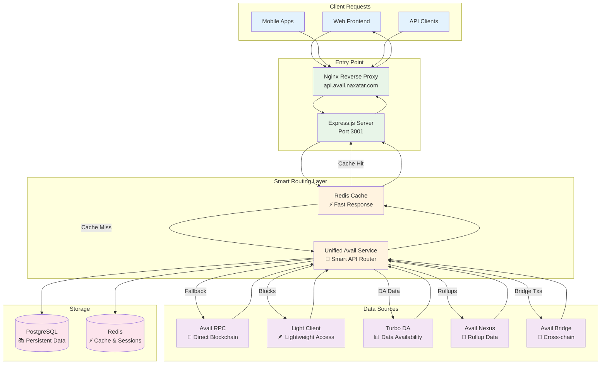
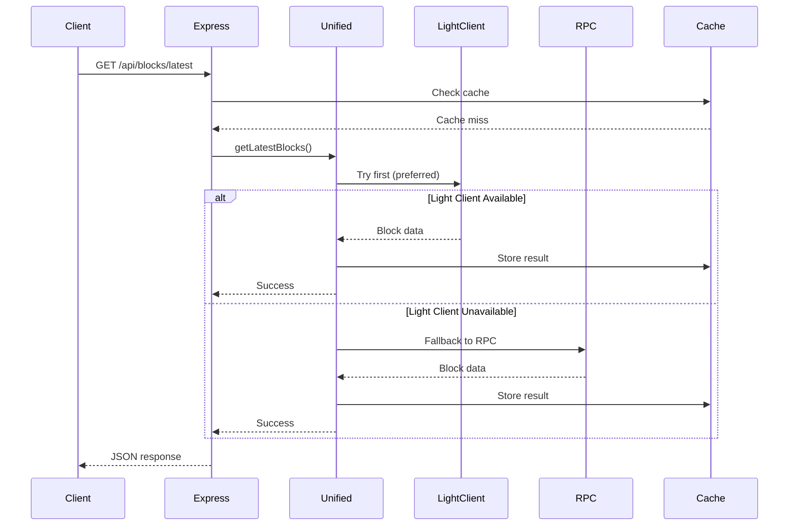
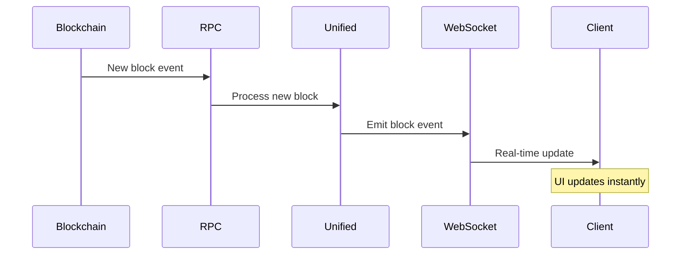
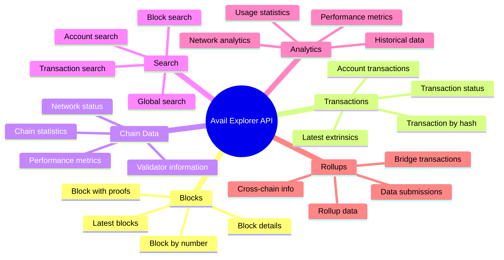

# Avail Explorer Backend - How It Works

## System Overview

The Avail Explorer Backend is a Node.js/TypeScript application that provides a unified API for accessing Avail blockchain data from multiple sources. Think of it as a smart aggregator that knows how to get blockchain data from different services and presents it through a single, consistent API.

### What Problem Does It Solve?

Avail blockchain data is scattered across multiple services:
- **Avail RPC**: Direct blockchain node access
- **Avail Light Client**: Lightweight blockchain access
- **Turbo DA**: Data availability layer
- **Avail Nexus**: Rollup and cross-chain data
- **Avail Bridge**: Cross-chain bridge transactions

Instead of clients having to know about all these services, our backend provides one unified API that intelligently routes requests to the best available source.

## Core Architecture - How Data Flows



## How Requests Are Handled

### 1. Request Arrives
When a client makes a request like `GET /api/blocks/latest`:

1. **Nginx** receives the request and routes it to the Express server
2. **Express** applies security middleware (CORS, rate limiting, compression)
3. **Cache Check**: Redis is checked for cached data first

### 2. Smart Routing Decision
If no cache hit, the **Unified Avail Service** makes intelligent routing decisions:

```typescript
// Example: Getting latest blocks
servicePreferences = {
  blocks: ['lightClient', 'rpc'],        // Try Light Client first, fallback to RPC
  extrinsics: ['rpc', 'nexus'],          // Try RPC first, fallback to Nexus
  accounts: ['nexus', 'rpc'],            // Try Nexus first, fallback to RPC
  proofs: ['bridge', 'lightClient'],     // Try Bridge first, fallback to Light Client
  dataSubmission: ['turboDA', 'lightClient'], // Try Turbo DA first
  crossChain: ['bridge'],                // Only Bridge for cross-chain data
}
```

### 3. Service Execution
The system tries services in order until one succeeds:



## Key Components Explained

### Unified Avail Service - The Brain
This is the core orchestrator that:
- **Knows which service to use** for different types of data
- **Handles fallbacks** when services are unavailable
- **Transforms data** from different sources into consistent formats
- **Manages health checks** across all services

**Real Example**: When you request block data, it first tries the Light Client (faster, more reliable), but if that's down, it automatically falls back to the direct RPC connection.

### Hybrid RPC Service - The Connector
Manages connections to the Avail blockchain with:
- **Multiple provider support** (different RPC endpoints)
- **Automatic failover** when one endpoint goes down
- **Connection pooling** for better performance
- **WebSocket management** for real-time updates

### Caching Strategy - The Speed Booster
Redis caching works at multiple levels:
- **API Response Caching**: Complete API responses cached for fast retrieval
- **Partial Data Caching**: Individual blocks, transactions cached separately
- **Real-time Data**: Live blockchain events cached briefly
- **Session Storage**: WebSocket connections and user sessions

### Real-time Updates - The Live Feed
WebSocket connections provide live updates:



## Practical Examples

### Example 1: Getting Block Data
```
User Request: GET /api/blocks/12345

1. Express receives request
2. Redis cache checked - miss
3. Unified Service routes to Light Client
4. Light Client returns block data
5. Data cached in Redis
6. Response sent to user
7. Next request for same block = instant cache hit
```

### Example 2: Service Failover
```
User Request: GET /api/extrinsics/latest

1. Express receives request
2. Unified Service tries RPC first
3. RPC is down - automatic fallback to Nexus
4. Nexus returns transaction data
5. Data transformed to standard format
6. Response sent to user
7. System logs the failover for monitoring
```

### Example 3: Real-time Block Updates
```
1. New block mined on Avail blockchain
2. RPC service receives WebSocket event
3. Unified Service processes the new block
4. Data stored in PostgreSQL
5. Cache updated with new data
6. WebSocket broadcasts to all connected clients
7. Frontend updates in real-time
```

## System Resilience

### How It Handles Failures

**Service Unavailable**: Automatic fallback to alternative services
```typescript
// If Light Client fails, try RPC
// If RPC fails, try Nexus
// If all fail, return cached data with warning
```

**Network Issues**: Connection pooling and retry logic
```typescript
// Automatic reconnection attempts
// Circuit breaker pattern to avoid cascading failures
// Graceful degradation with cached data
```

**High Load**: Multiple caching layers and rate limiting
```typescript
// Redis caching reduces database load
// Rate limiting prevents abuse
// Connection pooling manages resources
```

## Development vs Production

### Development Environment
- **Single Node.js process** with hot reloading
- **Network-based PostgreSQL** for consistency
- **Local Redis** for caching
- **Direct service connections** for debugging

### Production Environment
- **PM2 process management** for reliability
- **Nginx reverse proxy** with SSL termination
- **Native PostgreSQL/Redis** services
- **Multi-domain routing** (api.avail.naxatar.com)

## API Endpoints Overview

The system provides these main API categories:



## Monitoring & Health

### Health Checks
The system provides comprehensive health monitoring:
- `/health` - Overall system health
- `/metrics` - Prometheus metrics
- Service-specific health checks for each data source

### Logging
Structured logging with Winston:
- **Request/Response logging** for API calls
- **Service operation logging** for internal operations
- **Error logging** with context and stack traces
- **Performance logging** for optimization

### Metrics
Prometheus metrics for:
- API response times
- Service availability
- Cache hit rates
- Database performance
- WebSocket connections

## Key Benefits

1. **Unified Interface**: One API for all Avail data sources
2. **High Availability**: Automatic failover between services
3. **Performance**: Multi-layer caching and connection pooling
4. **Real-time**: WebSocket updates for live data
5. **Scalable**: Designed for high-load production use
6. **Observable**: Comprehensive monitoring and logging
7. **Resilient**: Graceful degradation when services fail

## File Structure - What's Where

```
src/
├── index.ts                 # Main application entry point
├── config/                  # Configuration management
├── routes/                  # API endpoint definitions
│   ├── blocks.ts           # Block-related endpoints
│   ├── extrinsics.ts       # Transaction endpoints
│   ├── chain.ts            # Chain statistics
│   └── ...
├── services/                # Business logic layer
│   ├── unified-avail.ts    # 🧠 Main orchestrator
│   ├── hybrid-rpc.ts       # RPC connection management
│   ├── blockchain.ts       # Core blockchain service
│   ├── turbo-da.ts         # Turbo DA integration
│   ├── avail-nexus.ts      # Nexus API integration
│   ├── avail-bridge.ts     # Bridge service
│   ├── avail-light-client.ts # Light client integration
│   └── data/               # Data layer services
├── middleware/              # Express middleware
├── utils/                   # Utilities (logging, database, cache)
└── types/                   # TypeScript type definitions
```

## Technical Implementation Details

### Package Dependencies - What We Use

The system uses these key packages for blockchain integration:

```json
{
  "dependencies": {
    "@polkadot/api": "^16.1.1",           // Main Polkadot API for blockchain calls
    "@polkadot/api-augment": "^16.1.1",   // Type augmentation for Avail
    "@polkadot/keyring": "^13.5.1",       // Key management and signing
    "@polkadot/rpc-core": "^16.1.1",      // Core RPC functionality
    "@polkadot/rpc-provider": "^16.1.1",  // WebSocket/HTTP providers
    "@polkadot/types": "^16.1.1",         // Type definitions
    "@polkadot/util": "^13.5.1",          // Utility functions
    "@polkadot/util-crypto": "^13.5.1",   // Cryptographic utilities
    "smoldot": "^2.0.35",                 // Light client implementation
    "axios": "^1.6.2",                    // HTTP client for external APIs
    "ws": "^8.18.2"                       // WebSocket client
  }
}
```

### Where Real API Calls Are Made

#### 1. Polkadot API Calls (Blockchain Data)
**Location**: `src/services/hybrid-rpc.ts` and `src/services/rpc/`

```typescript
// In hybrid-rpc.ts - Direct Polkadot API usage
import { ApiPromise } from '@polkadot/api';
import { WsProvider } from '@polkadot/rpc-provider';

private async initializePolkadotAPI(): Promise<void> {
  const provider = new WsProvider(config.avail.rpcEndpoint);
  this.api = await ApiPromise.create({ provider });
}

// Getting blocks using Polkadot API
private async getLatestBlocksPolkadot(query?: BlocksQuery): Promise<{ blocks: Block[]; total: number }> {
  const latestHeader = await this.api!.rpc.chain.getHeader();
  const blockHash = await this.api!.rpc.chain.getBlockHash(latestHeader.number);
  const block = await this.api!.rpc.chain.getBlock(blockHash);
  // Transform and return data
}
```

#### 2. External HTTP API Calls
**Location**: `src/services/turbo-da.ts`, `src/services/avail-nexus.ts`, `src/services/avail-bridge.ts`

```typescript
// In turbo-da.ts - HTTP calls to Turbo DA API
import axios, { AxiosInstance } from 'axios';

async submitRawData(data: Buffer): Promise<TurboSubmissionResponse> {
  const response = await this.httpClient.post('/submit/raw', data, {
    headers: { 'Content-Type': 'application/octet-stream' }
  });
  return response.data;
}

// In avail-nexus.ts - HTTP calls to Nexus API
async getRollupData(appId: number): Promise<any> {
  const response = await this.httpClient.get(`/rollups/${appId}`);
  return response.data;
}
```

#### 3. Light Client Integration
**Location**: `src/services/avail-light-client.ts`

```typescript
// Using Smoldot for light client functionality
import { start } from 'smoldot';

async initialize(): Promise<void> {
  this.client = start({
    maxLogLevel: 4,
    enableCurrentTask: true,
  });
  
  this.chain = await this.client.addChain({
    chainSpec: this.chainSpec,
    disableJsonRpc: false,
  });
}
```

### Database Usage - Current Implementation

#### 1. Database Connection
**Location**: `src/utils/database.ts`

```typescript
// PostgreSQL connection using pg library
import { Pool } from 'pg';

private initializePostgreSQL(): void {
  this.pgPool = new Pool({
    connectionString: this.dbConfig.url,
    ssl: this.dbConfig.ssl,
    max: 20,
    idleTimeoutMillis: 30000,
    connectionTimeoutMillis: 10000,
  });
}
```

#### 2. Current Database Operations
The database is currently used for:

**Analytics Storage** (`src/services/analytics.ts`):
```typescript
// Storing network statistics
const query = `
  INSERT INTO network_stats_snapshots (
    timestamp, total_blocks, total_extrinsics, total_accounts,
    avg_block_time, network_utilization, data_availability_score
  ) VALUES ($1, $2, $3, $4, $5, $6, $7)
`;
await db.query(query, values);

// Retrieving historical data
const query = 'SELECT * FROM network_stats_snapshots WHERE timestamp >= $1';
const result = await db.query(query, [intervalString]);
```

**Chain Statistics** (`src/services/blockchain.ts`):
```typescript
// Querying data submission statistics
const [
  totalSubmissions,
  totalDataSize,
  uniqueApps,
  uniqueSubmitters,
  todaySubmissions,
  todayDataSize
] = await Promise.all([
  db.query('SELECT COUNT(*) as count FROM data_submissions WHERE success = true'),
  db.query('SELECT COALESCE(SUM(data_size), 0) as total_size FROM data_submissions WHERE success = true'),
  db.query('SELECT COUNT(DISTINCT app_id) as count FROM data_submissions WHERE success = true'),
  // ... more queries
]);
```

#### 3. Database Schema (Current Tables)
Based on the queries found, these tables exist:

```sql
-- Network statistics snapshots
CREATE TABLE network_stats_snapshots (
  id SERIAL PRIMARY KEY,
  timestamp TIMESTAMP NOT NULL,
  total_blocks BIGINT,
  total_extrinsics BIGINT,
  total_accounts BIGINT,
  avg_block_time DECIMAL,
  network_utilization DECIMAL,
  data_availability_score DECIMAL,
  created_at TIMESTAMP DEFAULT CURRENT_TIMESTAMP
);

-- Data submissions tracking
CREATE TABLE data_submissions (
  id SERIAL PRIMARY KEY,
  app_id INTEGER,
  submitter VARCHAR(255),
  data_size BIGINT,
  success BOOLEAN,
  timestamp TIMESTAMP,
  created_at TIMESTAMP DEFAULT CURRENT_TIMESTAMP
);

-- Gas price history
CREATE TABLE gas_price_history (
  id SERIAL PRIMARY KEY,
  timestamp TIMESTAMP NOT NULL,
  gas_price DECIMAL,
  created_at TIMESTAMP DEFAULT CURRENT_TIMESTAMP
);

-- Rollups tracking
CREATE TABLE rollups (
  id SERIAL PRIMARY KEY,
  app_id INTEGER UNIQUE,
  name VARCHAR(255),
  created_at TIMESTAMP DEFAULT CURRENT_TIMESTAMP
);
```

### Request Flow - From Route to Database

Here's how a typical request flows through the system:

```typescript
// 1. Route Handler (src/routes/blocks.ts)
router.get('/', async (req: Request, res: Response) => {
  // Get data from blockchain service
  const blocksResult = await blockchainService.getLatestBlocks({ page, limit });
  
  // Transform and return
  res.json({ success: true, data: transformedBlocks });
});

// 2. Blockchain Service (src/services/blockchain.ts)
async getLatestBlocks(query: BlocksQuery) {
  // Route to unified service
  return this.unifiedAvail.getLatestBlocks(query);
}

// 3. Unified Service (src/services/unified-avail.ts)
async getLatestBlocks(query?: BlocksQuery) {
  // Try Light Client first
  if (this.lightClient.isConnected()) {
    return this.lightClient.getLatestBlocks(query);
  }
  // Fallback to RPC
  return this.rpc.getLatestBlocks(query);
}

// 4. RPC Service (src/services/hybrid-rpc.ts)
async getLatestBlocks(query?: BlocksQuery) {
  // Make actual Polkadot API call
  const latestHeader = await this.api!.rpc.chain.getHeader();
  const block = await this.api!.rpc.chain.getBlock(blockHash);
  
  // Store in database for analytics (if needed)
  await db.query('INSERT INTO block_stats ...', values);
  
  return transformedBlocks;
}
```

### Key Insights

1. **No Direct Database Storage of Blockchain Data**: The system doesn't store blocks/transactions in PostgreSQL. It fetches them live from blockchain sources and caches in Redis.

2. **Database Used for Analytics**: PostgreSQL stores aggregated statistics, performance metrics, and historical analytics data.

3. **Polkadot API is Primary**: The `@polkadot/api` package is used for all direct blockchain interactions via WebSocket RPC.

4. **HTTP APIs for Specialized Services**: Axios is used for REST API calls to Turbo DA, Nexus, and Bridge services.

5. **Smart Caching Strategy**: Redis caches API responses while PostgreSQL stores long-term analytics.

## Next Steps for Understanding

1. **Start with `src/index.ts`** - See how the application initializes
2. **Look at `src/services/unified-avail.ts`** - Understand the smart routing
3. **Check `src/routes/blocks.ts`** - See how API endpoints work
4. **Explore `src/services/hybrid-rpc.ts`** - Understand blockchain connections
5. **Review `src/middleware/index.ts`** - See how requests are processed

This architecture provides a robust, scalable foundation for the Avail Explorer while maintaining simplicity and reliability. 