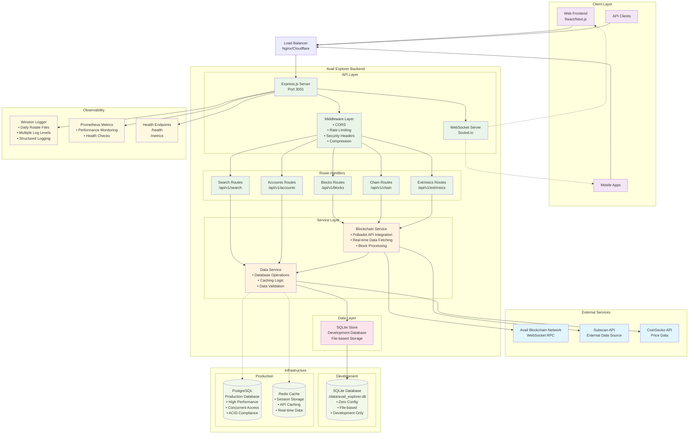
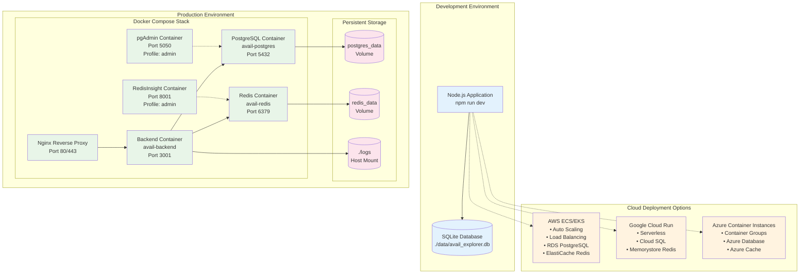
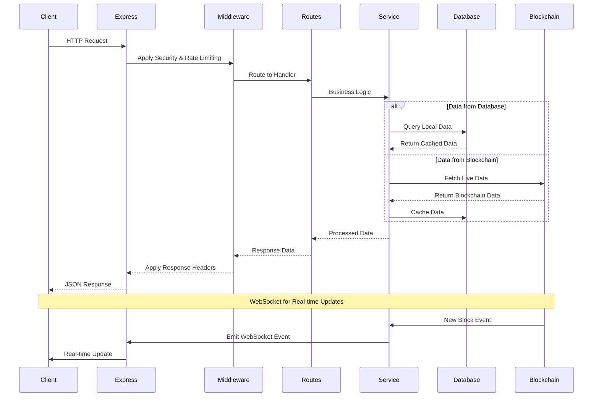
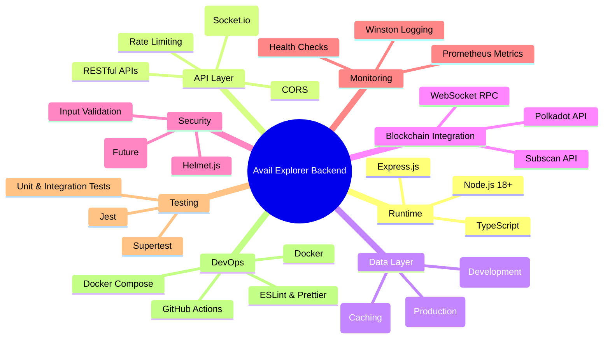

# Avail Explorer Backend - Project Architecture

## Overview
This document contains mermaid diagrams explaining the architecture of the Avail Explorer Backend project.

## Main Architecture Diagram

## Deployment Architecture

## API Flow Diagram

## Technology Stack

## Key Features

1. **Dual Database Support**: SQLite for development, PostgreSQL for production
2. **Real-time Updates**: WebSocket integration for live blockchain data
3. **API Fallback**: Direct blockchain integration with external API fallbacks
4. **Comprehensive Monitoring**: Health checks, metrics, and structured logging
5. **Development-friendly**: Zero-config setup with SQLite
6. **Production-ready**: Docker containerization with orchestration
7. **Scalable Architecture**: Microservice-ready design with clear separation of concerns

## Future Enhancements

- Authentication & Authorization (JWT)
- Advanced Analytics Routes
- Validator Information
- Enhanced Caching Strategies
- Kubernetes Deployment
- API Documentation (Swagger/OpenAPI) 