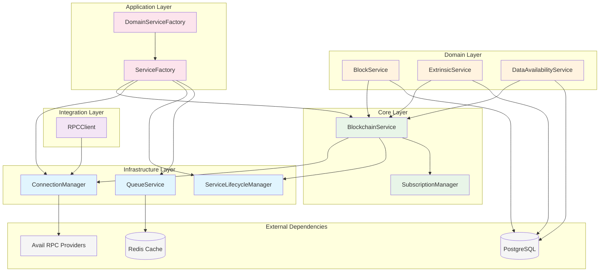
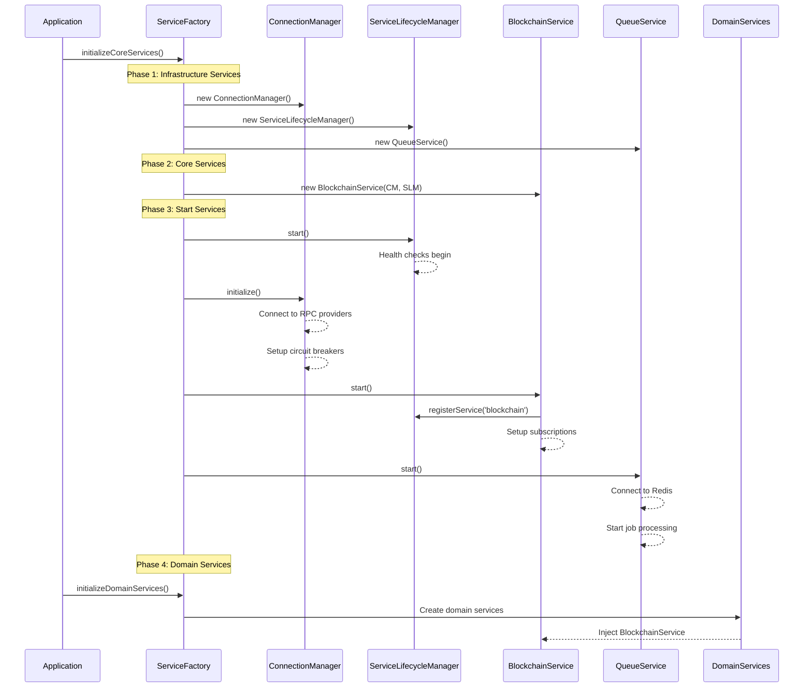
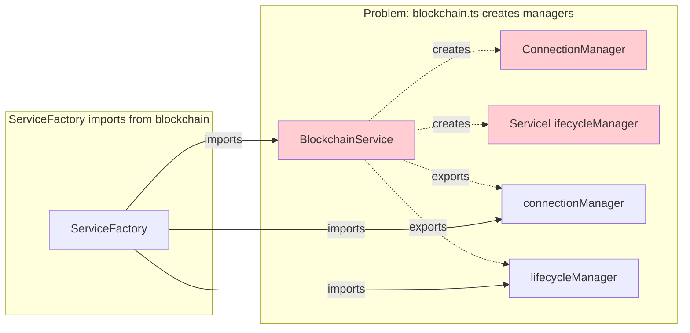
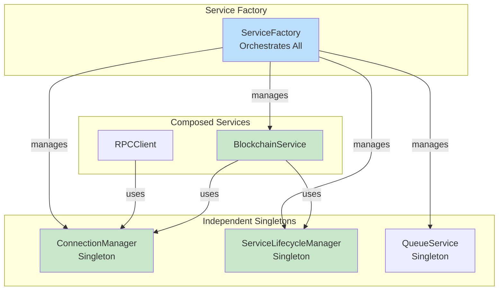
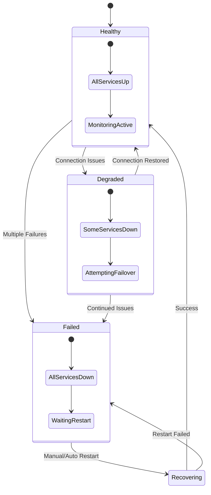

# Avail DA Explorer - Service Dependencies & Initialization Graph

## Overview

This document visualizes the dependencies between services in the Avail DA Explorer backend and their initialization lifecycle.

## 🏗️ Service Architecture Dependency Graph



## 🔄 Service Initialization Lifecycle



## 📊 Current vs Ideal Dependency Structure

### ❌ Current Problem (Circular Dependencies)



### ✅ Ideal Solution (Clean Dependencies)



## 🎯 Service Responsibility Matrix

| Service | Primary Responsibility | Dependencies | Exports |
|---------|----------------------|--------------|---------|
| **ConnectionManager** | RPC connection management, failover, circuit breakers | Avail RPC Providers | Singleton instance |
| **ServiceLifecycleManager** | Service lifecycle, health checks, metrics aggregation | None | Singleton instance |
| **BlockchainService** | Domain operations, subscription management | ConnectionManager, ServiceLifecycleManager | Singleton instance |
| **RPCClient** | Retry logic, RPC call abstraction | ConnectionManager | Factory function |
| **QueueService** | Background job processing | Redis | Singleton instance |
| **SubscriptionManager** | Real-time subscription coordination | BlockchainService | Internal to BlockchainService |

## 🚀 Initialization Order & Timing

```mermaid
gantt
    title Service Initialization Timeline
    dateFormat X
    axisFormat %s

    section Infrastructure
    ConnectionManager     :0, 2
    ServiceLifecycleManager :0, 1
    QueueService         :1, 2

    section Core
    BlockchainService    :2, 4
    SubscriptionManager  :3, 4

    section Domain
    BlockService         :4, 5
    ExtrinsicService     :4, 5
    DataAvailabilityService :4, 5

    section Health Checks
    Health Monitoring    :2, 10
```



## 🔍 Detailed Service Interactions

### Connection Flow
```mermaid
flowchart TD
    A[Domain Service Request] --> B{BlockchainService}
    B --> C[ConnectionManager.getHealthyConnection()]
    C --> D{Circuit Breaker Check}
    D -->|Open| E[Try Next Provider]
    D -->|Closed| F[Return Connection]
    E --> G[Provider Failover]
    G --> D
    F --> H[Execute RPC Call]
    H --> I[Update Metrics]
    I --> J[Return Result]
```

### Health Check Flow
```mermaid
flowchart TD
    A[ServiceLifecycleManager] --> B[Health Check Timer]
    B --> C[Check All Registered Services]
    C --> D[ConnectionManager.getHealth()]
    C --> E[BlockchainService.getHealth()]
    C --> F[QueueService.getHealth()]
    D --> G[Aggregate Health Status]
    E --> G
    F --> G
    G --> H[Log Unhealthy Services]
    H --> I[Update Metrics]
    I --> B
```

### Error Handling & Recovery


## 📈 Metrics & Monitoring Flow

```mermaid
flowchart LR
    subgraph "Metrics Collection"
        CM[ConnectionManager<br/>Metrics]
        SLM[ServiceLifecycleManager<br/>Metrics]
        BS[BlockchainService<br/>Metrics]
        RPC[RPCClient<br/>Metrics]
    end
    
    subgraph "Aggregation"
        SF[ServiceFactory<br/>getMetrics()]
    end
    
    subgraph "Consumers"
        API[Health API]
        MON[Monitoring Dashboard]
        LOG[Logging System]
    end

    CM --> SF
    SLM --> SF
    BS --> SF
    RPC --> SF
    
    SF --> API
    SF --> MON
    SF --> LOG
```

## 🔧 Refactoring Recommendations

### 1. **Separate Service Creation**
```typescript
// ❌ Current: blockchain.ts creates managers
const sharedConnectionManager = new ConnectionManager();

// ✅ Recommended: Independent singletons
// src/services/core/connection-manager.ts
export const connectionManager = new ConnectionManager();
```

### 2. **Clean Dependency Injection**
```typescript
// ✅ Recommended Pattern
export class BlockchainService {
  constructor(
    private connectionManager: ConnectionManager,
    private lifecycleManager: ServiceLifecycleManager
  ) {}
}
```

### 3. **Service Factory Orchestration**
```typescript
// ✅ ServiceFactory manages all services
class ServiceFactory {
  async initializeCoreServices() {
    // Create independent services
    this.register('connectionManager', connectionManager);
    this.register('lifecycleManager', serviceLifecycleManager);
    
    // Create composed services
    const blockchain = new BlockchainService(
      this.get('connectionManager'),
      this.get('lifecycleManager')
    );
    this.register('blockchain', blockchain);
  }
}
```

## 🎯 Benefits of Proper Architecture

1. **🧪 Testability**: Each service can be unit tested independently
2. **🔄 Reusability**: ConnectionManager can be used by KateRPCService, analytics services
3. **🏗️ Maintainability**: Clear separation of concerns
4. **📊 Monitoring**: Centralized health checks and metrics
5. **🚀 Performance**: Parallel initialization, optimized startup
6. **🛡️ Reliability**: Circuit breakers, failover, retry logic

## 🚨 Current Architecture Issues

### Issue 1: Circular Dependencies in blockchain.ts
**Location**: `src/services/core/blockchain.ts` lines 320-327

**Problem**:
```typescript
// ❌ BlockchainService creates and exports managers
const sharedLifecycleManager = new ServiceLifecycleManager();
const sharedConnectionManager = new ConnectionManager();

export const blockchainService = new BlockchainService(
  sharedConnectionManager,
  sharedLifecycleManager,
);

export { sharedConnectionManager as connectionManager };
export { sharedLifecycleManager as lifecycleManager };
```

**Impact**:
- Tight coupling between services
- Hard to test ConnectionManager independently
- Circular dependency when ServiceFactory imports these

### Issue 2: ServiceFactory Dependency Confusion
**Location**: `src/services/index.ts` lines 5, 12, 61-63

**Problem**:
```typescript
// ServiceFactory imports managers created by BlockchainService
import { blockchainService, connectionManager, lifecycleManager } from './core/blockchain';

// Then registers them as if they were independent
this.register('connectionManager', connectionManager);
this.register('lifecycleManager', lifecycleManager);
```

**Impact**:
- Confusing ownership model
- Can't start ConnectionManager without BlockchainService
- Violates Single Responsibility Principle

### Recommended Fix:
```typescript
// ✅ Each service as independent singleton

// src/services/core/connection-manager.ts
export const connectionManager = new ConnectionManager();

// src/services/core/service-lifecycle-manager.ts
export const serviceLifecycleManager = new ServiceLifecycleManager();

// src/services/core/blockchain.ts
import { connectionManager } from './connection-manager';
import { serviceLifecycleManager } from './service-lifecycle-manager';

export const blockchainService = new BlockchainService(
  connectionManager,
  serviceLifecycleManager
);
```

---

*This document serves as both current state documentation and refactoring roadmap for the Avail DA Explorer service architecture.* 