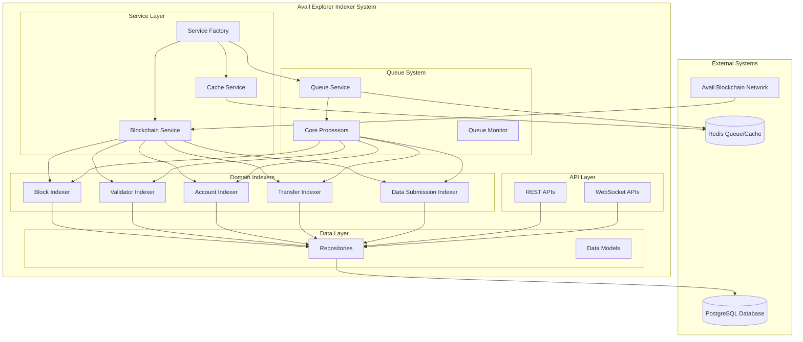
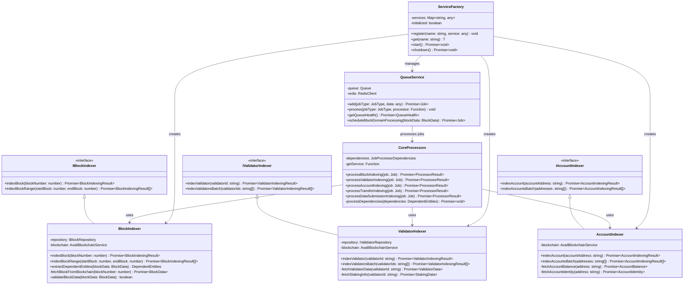
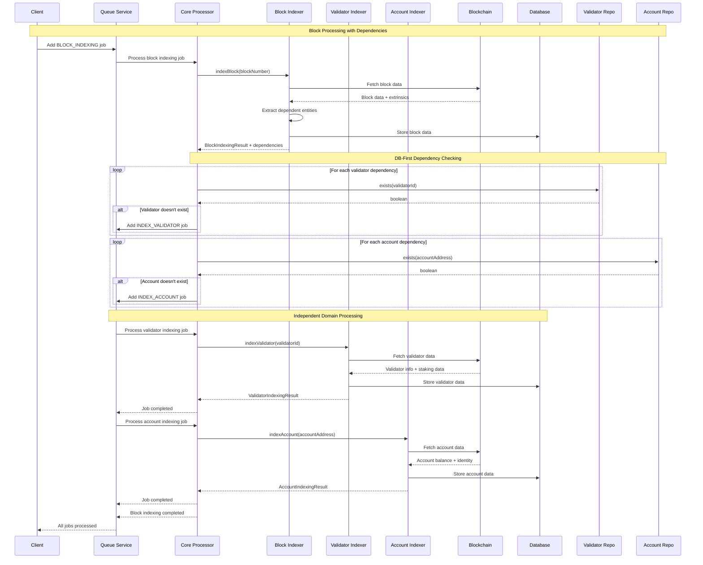
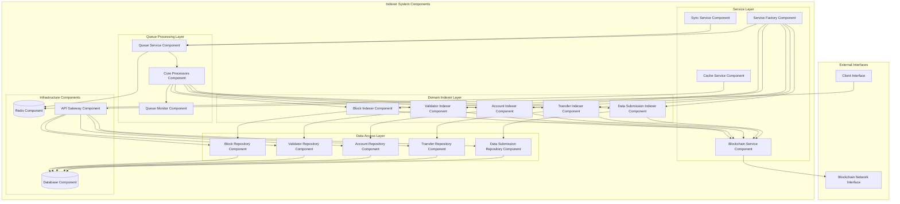
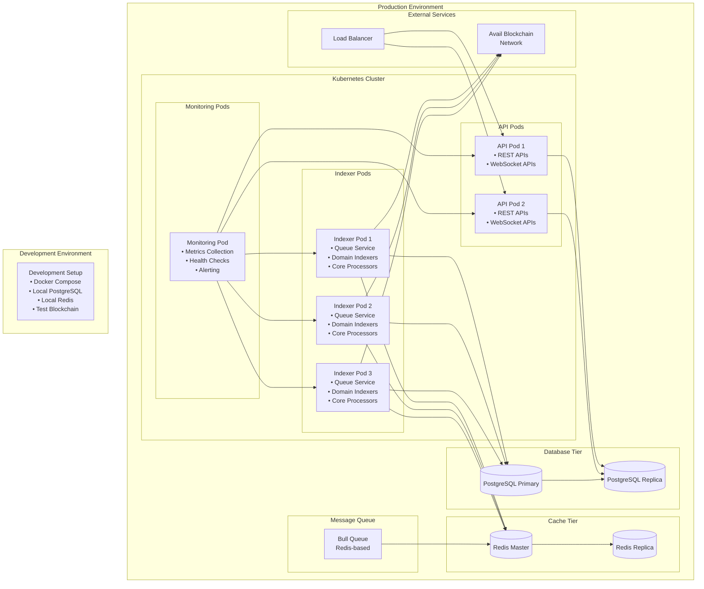
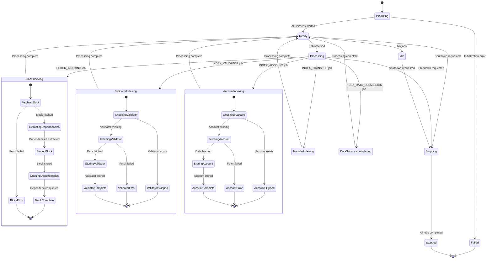
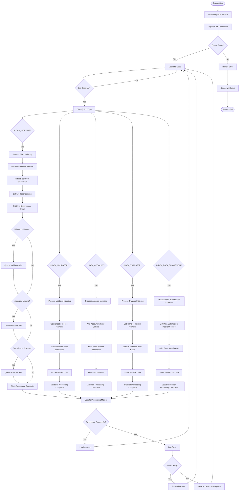

# Avail Explorer Indexer Architecture - Software Engineering Charts

## Table of Contents
1. [System Architecture Diagram](#system-architecture-diagram)
2. [UML Class Diagram](#uml-class-diagram)
3. [Data Flow Diagram](#data-flow-diagram)
4. [Sequence Diagram](#sequence-diagram)
5. [Component Diagram](#component-diagram)
6. [Deployment Diagram](#deployment-diagram)
7. [State Diagram](#state-diagram)
8. [Entity Relationship Diagram](#entity-relationship-diagram)
9. [Queue Processing Flow](#queue-processing-flow)
10. [Domain Interaction Diagram](#domain-interaction-diagram)

---

## System Architecture Diagram



---

## UML Class Diagram



---

## Data Flow Diagram

```mermaid
graph TD
    subgraph "Level 0 - Context Diagram"
        EXT[External Users/Systems]
        SYSTEM[Avail Explorer Indexer]
        BC[Avail Blockchain]
        DB[(Database)]
        
        EXT --> SYSTEM
        SYSTEM --> BC
        SYSTEM --> DB
        BC --> SYSTEM
        DB --> SYSTEM
    end
    
    subgraph "Level 1 - System Overview"
        INPUT[Blockchain Data Input]
        PROCESS[Index Processing]
        QUEUE[Queue Management]
        STORAGE[Data Storage]
        OUTPUT[API Output]
        
        INPUT --> PROCESS
        PROCESS --> QUEUE
        QUEUE --> PROCESS
        PROCESS --> STORAGE
        STORAGE --> OUTPUT
    end
    
    subgraph "Level 2 - Detailed Data Flow"
        BC2[Blockchain Network]
        
        subgraph "Indexing Process"
            FETCH[Fetch Block Data]
            EXTRACT[Extract Dependencies]
            VALIDATE[Validate Data]
        end
        
        subgraph "Queue System"
            SCHEDULE[Schedule Jobs]
            DISTRIBUTE[Distribute to Domains]
            MONITOR[Monitor Progress]
        end
        
        subgraph "Domain Processing"
            PBLOCK[Process Blocks]
            PVALIDATOR[Process Validators]
            PACCOUNT[Process Accounts]
            PTRANSFER[Process Transfers]
            PDATA[Process Data Submissions]
        end
        
        subgraph "Data Storage"
            REPO[Repositories]
            DB2[(PostgreSQL)]
            CACHE[(Redis Cache)]
        end
        
        BC2 --> FETCH
        FETCH --> EXTRACT
        EXTRACT --> VALIDATE
        VALIDATE --> SCHEDULE
        
        SCHEDULE --> DISTRIBUTE
        DISTRIBUTE --> PBLOCK
        DISTRIBUTE --> PVALIDATOR
        DISTRIBUTE --> PACCOUNT
        DISTRIBUTE --> PTRANSFER
        DISTRIBUTE --> PDATA
        
        PBLOCK --> REPO
        PVALIDATOR --> REPO
        PACCOUNT --> REPO
        PTRANSFER --> REPO
        PDATA --> REPO
        
        REPO --> DB2
        REPO --> CACHE
    end
```



---

## Sequence Diagram



---

## Component Diagram



---

## Deployment Diagram



---

## State Diagram



---

## Entity Relationship Diagram

```mermaid
erDiagram
    BLOCK {
        int number PK
        string hash UK
        string parent_hash
        string state_root
        string extrinsics_root
        datetime timestamp
        int extrinsics_count
        datetime created_at
        datetime updated_at
    }
    
    VALIDATOR {
        string stash_address PK
        string controller_address
        string session_keys
        string identity_display
        string identity_legal
        decimal commission
        boolean active
        bigint total_stake
        datetime created_at
        datetime updated_at
    }
    
    ACCOUNT {
        string address PK
        string identity_display
        string identity_legal
        bigint free_balance
        bigint reserved_balance
        bigint frozen_balance
        int nonce
        boolean is_validator
        datetime created_at
        datetime updated_at
    }
    
    TRANSFER {
        string id PK
        string extrinsic_hash FK
        int block_number FK
        int extrinsic_index
        string from_address FK
        string to_address FK
        bigint amount
        string token_type
        bigint fees
        string status
        datetime timestamp
        datetime created_at
        datetime updated_at
    }
    
    DATA_SUBMISSION {
        int id PK
        string extrinsic_hash
        int block_number FK
        int extrinsic_index
        int app_id FK
        string rollup_name
        int data_size
        string data_hash
        string submitter FK
        datetime timestamp
        boolean success
        text blob_data
        string kate_commitment
        text proof
        datetime created_at
        datetime updated_at
    }
    
    ROLLUP {
        int app_id PK
        string name
        string description
        int first_seen_block
        int last_active_block
        int total_submissions
        bigint total_data_size
        bigint total_fees_paid
        datetime created_at
        datetime updated_at
    }
    
    NOMINATION {
        string id PK
        string nominator_address FK
        string validator_address FK
        bigint amount
        datetime created_at
        datetime updated_at
    }
    
    ERA {
        int era_index PK
        int start_block
        int end_block
        datetime start_time
        datetime end_time
        int validator_count
        bigint total_stake
        datetime created_at
        datetime updated_at
    }
    
    REWARD {
        string id PK
        int era_index FK
        string validator_address FK
        string nominator_address FK
        bigint amount
        string reward_type
        datetime created_at
        datetime updated_at
    }
    
    %% Relationships
    BLOCK ||--o{ TRANSFER : contains
    BLOCK ||--o{ DATA_SUBMISSION : contains
    
    VALIDATOR ||--o{ NOMINATION : receives
    VALIDATOR ||--o{ REWARD : earns
    
    ACCOUNT ||--o{ TRANSFER : from
    ACCOUNT ||--o{ TRANSFER : to
    ACCOUNT ||--o{ NOMINATION : makes
    ACCOUNT ||--o{ REWARD : receives
    ACCOUNT ||--o{ DATA_SUBMISSION : submits
    
    ROLLUP ||--o{ DATA_SUBMISSION : contains
    
    ERA ||--o{ REWARD : distributes
```

---

## Queue Processing Flow



---

## Domain Interaction Diagram

```mermaid
graph TB
    subgraph "Blockchain Network"
        AVAIL[Avail Blockchain<br/>RPC Endpoints]
    end
    
    subgraph "Queue System"
        QUEUE[Redis Queue]
        PROCESSOR[Core Processor]
    end
    
    subgraph "Domain Indexers"
        BI[Block Indexer<br/>• Fetches blocks<br/>• Extracts dependencies<br/>• Stores block data]
        
        VI[Validator Indexer<br/>• Fetches validator info<br/>• Processes staking data<br/>• Handles identity]
        
        AI[Account Indexer<br/>• Fetches account data<br/>• Processes balances<br/>• Handles identity]
        
        TI[Transfer Indexer<br/>• Extracts transfers<br/>• Processes events<br/>• Handles deduplication]
        
        DSI[Data Submission Indexer<br/>• Processes submissions<br/>• Handles app IDs<br/>• Manages rollups]
    end
    
    subgraph "Repository Layer"
        BR[Block Repository<br/>• CRUD operations<br/>• exists() check]
        
        VR[Validator Repository<br/>• CRUD operations<br/>• exists() check<br/>• Staking queries]
        
        AR[Account Repository<br/>• CRUD operations<br/>• exists() check<br/>• Balance queries]
        
        TR[Transfer Repository<br/>• CRUD operations<br/>• exists() check<br/>• Transfer queries]
        
        DSR[Data Submission Repository<br/>• CRUD operations<br/>• exists() check<br/>• Rollup queries]
    end
    
    subgraph "Database"
        DB[(PostgreSQL<br/>Persistent Storage)]
    end
    
    %% Blockchain connections
    AVAIL -.->|RPC Calls| BI
    AVAIL -.->|RPC Calls| VI
    AVAIL -.->|RPC Calls| AI
    AVAIL -.->|RPC Calls| TI
    AVAIL -.->|RPC Calls| DSI
    
    %% Queue processing flow
    QUEUE --> PROCESSOR
    PROCESSOR -->|BLOCK_INDEXING| BI
    PROCESSOR -->|INDEX_VALIDATOR| VI
    PROCESSOR -->|INDEX_ACCOUNT| AI
    PROCESSOR -->|INDEX_TRANSFER| TI
    PROCESSOR -->|INDEX_DATA_SUBMISSION| DSI
    
    %% Dependency queuing (DB-first)
    BI -.->|Check exists()| VR
    BI -.->|Check exists()| AR
    BI -.->|Queue if missing| QUEUE
    
    %% Data storage
    BI --> BR
    VI --> VR
    AI --> AR
    TI --> TR
    DSI --> DSR
    
    %% Database persistence
    BR --> DB
    VR --> DB
    AR --> DB
    TR --> DB
    DSR --> DB
    
    %% Styling
    classDef indexer fill:#e1f5fe,stroke:#01579b,stroke-width:2px
    classDef repo fill:#f3e5f5,stroke:#4a148c,stroke-width:2px
    classDef queue fill:#fff3e0,stroke:#e65100,stroke-width:2px
    classDef blockchain fill:#e8f5e8,stroke:#2e7d32,stroke-width:2px
    classDef database fill:#fce4ec,stroke:#880e4f,stroke-width:2px
    
    class BI,VI,AI,TI,DSI indexer
    class BR,VR,AR,TR,DSR repo
    class QUEUE,PROCESSOR queue
    class AVAIL blockchain
    class DB database
```

---

## Summary

These software engineering charts provide comprehensive documentation of the Avail Explorer Indexer architecture:

1. **System Architecture**: High-level overview of system components and their relationships
2. **UML Class Diagram**: Object-oriented design showing classes, interfaces, and relationships
3. **Data Flow Diagram**: How data moves through the system at different levels of detail
4. **Sequence Diagram**: Time-ordered interactions between components during block processing
5. **Component Diagram**: Physical organization of software components and their dependencies
6. **Deployment Diagram**: How the system is deployed in production and development environments
7. **State Diagram**: System states and transitions during processing lifecycle
8. **Entity Relationship Diagram**: Database schema and relationships between data entities
9. **Queue Processing Flow**: Detailed flow of job processing through the queue system
10. **Domain Interaction Diagram**: How domain indexers interact with each other and external systems

These charts serve as:
- **Documentation** for new team members
- **Design reference** for system modifications
- **Communication tool** for stakeholders
- **Troubleshooting guide** for operational issues
- **Architecture validation** for design reviews

The diagrams use Mermaid syntax for easy integration into documentation systems and can be rendered in most modern markdown viewers and documentation platforms.